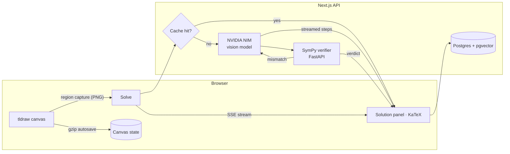
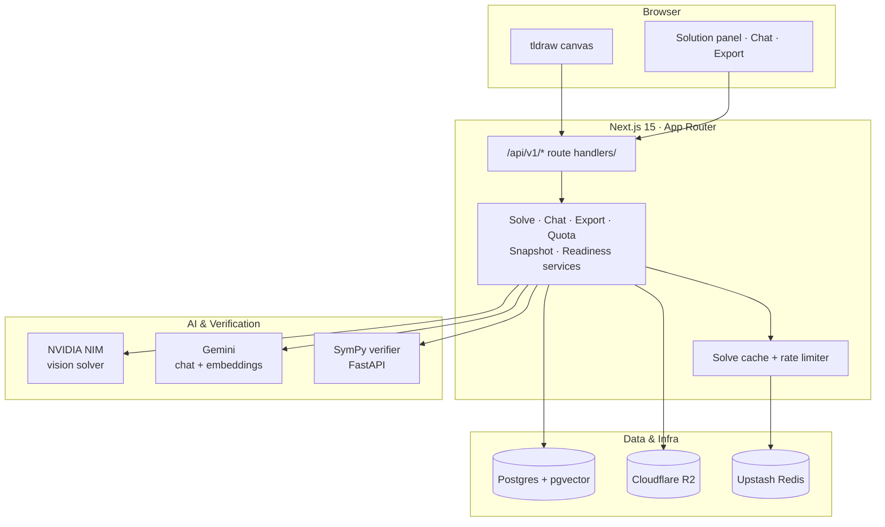

<div align="center">


# InkSolver

**The open-source AI whiteboard that solves STEM problems as you draw them.**

Sketch an equation, circuit, or chemistry problem on an infinite canvas — InkSolver reads your ink with a vision model, streams a step-by-step solution beside your work, and checks every answer against a symbolic math engine.

[**Live Demo**](https://inksolver.vercel.app) · [Report a Bug](https://github.com/sx4im/InkSolver/issues/new?template=bug_report.md) · [Request a Feature](https://github.com/sx4im/InkSolver/issues/new?template=feature_request.md)

[](https://github.com/sx4im/InkSolver/actions/workflows/ci.yml)
[](LICENSE)
[](CONTRIBUTING.md)
[](https://nextjs.org/)
[](https://www.typescriptlang.org/)
[](https://tldraw.dev/)

[](https://github.com/sx4im/InkSolver/stargazers)
[](https://github.com/sx4im/InkSolver/fork)

**If InkSolver helps you, [give it a star](https://github.com/sx4im/InkSolver/stargazers) — it helps more students and developers find the project.**

</div>

---

## Why InkSolver?

Math help tools make you *type* LaTeX or photograph paper. InkSolver meets you where STEM work actually happens — **freehand, on a whiteboard** — and treats correctness as a feature:

- **Draw, don't transcribe** — solve directly from your handwriting and diagrams
- **Watch it think** — solution steps stream in live as the model writes them
- **Trust, but verify** — every answer is checked by SymPy; mismatches trigger an automatic re-solve, and anything unconfirmed is *flagged*, never hidden
- **Ask why** — every step has a context-aware follow-up chat (with voice input)
- **Own your stack** — MIT-licensed, self-hostable, no vendor lock-in

## Features

| | |
|---|---|
| **Infinite canvas** | Powered by [tldraw](https://tldraw.dev) — pen, shapes, text, images, full undo/redo |
| **Multimodal solving** | Select a region (or just press **Solve** for the visible board) — vision model + structured streaming |
| **Typeset math** | Solutions render as KaTeX, not raw LaTeX strings |
| **Symbolic verification** | A Python/SymPy microservice differentiates, simplifies, and confirms each step |
| **Resilient autosave** | Debounced, gzip-compressed (~10×) saves with retry/backoff, offline recovery, and unsaved-work warnings |
| **Real exports** | PDF embedding your actual board + worked solutions, raw PNG, or LaTeX source |
| **Public sharing** | Read-only share links with OG previews; visitors can remix into their own copy |
| **Semantic search** | Find past solutions by meaning, across every canvas (Pro) |
| **Cost-aware** | Token/cost accounting per solve, response caching for repeated problems, quota refunds on failures |
| **Mobile-ready** | Solve, save, share, and chat from a phone |

## How it works



1. The browser captures your selection (or visible board) as an image — adaptively scaled so even huge diagrams fit.
2. The solver streams structured JSON; each step is parsed out and forwarded to your screen **the moment the model finishes writing it**.
3. The SymPy service verifies the result symbolically. A mismatch triggers one corrective re-solve with the verifier's feedback.
4. Verified byte-identical re-solves are served from cache — no tokens, no quota.

## Architecture

The app is one Next.js deployment that owns the canvas, the API, and all orchestration. AI
inference and symbolic verification sit behind service modules, so each can be swapped or mocked
independently — which is why the whole product still runs when none of them are configured.



## Tech stack

| Layer | Technology |
|-------|-----------|
| Frontend | Next.js 15 (App Router), React 19, TypeScript, Tailwind CSS, KaTeX |
| Whiteboard | tldraw v5 |
| Auth | Clerk |
| Database | PostgreSQL + pgvector (Neon-ready), Drizzle ORM |
| AI solving | NVIDIA NIM (StepFun `step-3.7-flash`, streaming) |
| Chat & embeddings | Gemini |
| Verification | Python · FastAPI · SymPy |
| Storage | Cloudflare R2 (optional) |
| Rate limiting | Upstash Redis (optional, falls back to in-memory) |
| Billing | Lemon Squeezy (HMAC-verified webhooks) |
| Observability | PostHog, Sentry, built-in cost/latency dashboard |

## Quick start

**Prerequisites:** Node.js 18+, pnpm, Docker (optional, for local Postgres + verifier), Python 3.11+ (only if running the verifier without Docker).

```bash
git clone https://github.com/sx4im/InkSolver.git
cd InkSolver
pnpm install

# Optional: local Postgres (pgvector) + SymPy verifier
docker compose up -d
cp .env.example .env.local   # then fill in what you have

pnpm db:migrate              # skip to run on the zero-setup local JSON store
pnpm dev
```

Open `http://localhost:3000`. **Everything degrades gracefully**: without `DATABASE_URL` the app runs on a local JSON store, and without `NVIDIA_API_KEY` it solves with a mock in development — so you can explore the full product with zero keys.

### Configuration

<details>
<summary><b>Environment variable reference</b> (click to expand)</summary>

| Variable | Required | Purpose |
|---|---|---|
| `DATABASE_URL` | production | Postgres (pgvector). Local JSON store used when absent |
| `NEXT_PUBLIC_CLERK_PUBLISHABLE_KEY` / `CLERK_SECRET_KEY` | production | Authentication |
| `NEXT_PUBLIC_CLERK_SIGN_IN_URL` / `NEXT_PUBLIC_CLERK_SIGN_UP_URL` | production | Set to `/sign-in` and `/sign-up` so signed-out users land on the in-app auth pages |
| `NVIDIA_API_KEY` / `NVIDIA_MODEL` | production | Vision solver (mock in dev when absent) |
| `NVIDIA_TIMEOUT_MS`, `NVIDIA_INPUT_COST_PER_MTOK`, `NVIDIA_OUTPUT_COST_PER_MTOK` | no | Solver timeout + real $ cost accounting |
| `GEMINI_API_KEY` | no | Follow-up chat + semantic-search embeddings |
| `SYMPY_VERIFIER_URL` | no | Hosted verifier; answers report "unverifiable" without it |
| `CLOUDFLARE_R2_*` | no | Snapshot object storage (local disk in dev) |
| `UPSTASH_REDIS_REST_URL` / `UPSTASH_REDIS_REST_TOKEN` | no | Rate limits shared across serverless instances |
| `LEMON_SQUEEZY_CHECKOUT_URL` / `LEMON_SQUEEZY_WEBHOOK_SECRET` | no | Pro upgrades |
| `POSTHOG_KEY` / `POSTHOG_HOST`, `SENTRY_INGEST_URL` | no | Analytics & error tracking |
| `NEXT_PUBLIC_APP_URL` | production | Absolute URL for share/OG metadata |
| `NEXT_PUBLIC_TLDRAW_LICENSE_KEY` | no | Free at [tldraw.dev](https://tldraw.dev) |
| `INKSOLVER_OWNER_EMAIL` / `INKSOLVER_ADMIN_TOKEN` | no | Gate `/readiness` + observability APIs in production |

The built-in **`/readiness` dashboard** tracks every gate live as you configure it.

</details>

### Quality checks

```bash
pnpm typecheck && pnpm lint && pnpm build   # static checks + production build
pnpm smoke:local                            # 23-check end-to-end API suite
pnpm test:e2e                               # Playwright browser tests
cd services/verifier && pytest              # symbolic verifier tests
```

CI runs all of the above on every push.

### Scripts

| Command | What it does |
|---|---|
| `pnpm dev` | Start the Next.js dev server |
| `pnpm build` / `pnpm start` | Production build and serve |
| `pnpm lint` / `pnpm typecheck` | ESLint and `tsc --noEmit` |
| `pnpm test:e2e` | Playwright end-to-end tests |
| `pnpm smoke:local` | Local end-to-end API smoke suite |
| `pnpm db:push` | Push the Drizzle schema to the database |
| `pnpm db:generate` / `pnpm db:migrate` | Generate and apply SQL migrations |
| `pnpm seed:demo` | Seed demo data |

## Deployment

[](https://vercel.com/new/clone?repository-url=https%3A%2F%2Fgithub.com%2Fsx4im%2FInkSolver)

1. **App** — click the button (or connect the repo on Vercel), add your environment variables, deploy.
2. **Database** — create a [Neon](https://neon.tech) Postgres, set `DATABASE_URL`, run `pnpm db:migrate`.
3. **Verifier** — deploy `services/verifier/` (Dockerfile included) to Railway, Fly.io, or Cloud Run; set `SYMPY_VERIFIER_URL`.
4. Open `/readiness` to confirm every production gate is green.

## Project structure

```
src/
├── app/             # Next.js App Router pages + /api/v1 route handlers
├── components/      # Canvas workspace, dashboard, share, math (KaTeX), UI kit
├── server/          # Solve orchestration, verification, quotas, exports, guards
├── db/              # Drizzle schema + client (migrations in /drizzle)
└── lib/             # Shared types & utilities
services/verifier/   # Python FastAPI + SymPy symbolic verification service
scripts/             # Smoke suite, demo seed, embedding backfill
tests/e2e/           # Playwright specs
```

## Roadmap

- [x] Live-streamed multimodal solving with symbolic verification
- [x] KaTeX rendering, real PDF/PNG/LaTeX exports, public sharing & remixing
- [x] Solve caching, gzip autosave, semantic search, cost dashboards
- [ ] Real-time multiplayer cursors (tldraw sync)
- [ ] Handwriting OCR for editable problem text
- [ ] More verifier rules: linear systems, limits, unit-aware physics
- [ ] React Native companion app

Have an idea? [Open a feature request](https://github.com/sx4im/InkSolver/issues/new?template=feature_request.md).

## Contributing

Contributions of every size are welcome — verifier rules, UI polish, docs, and bug reports all move the project forward.

1. Read [CONTRIBUTING.md](CONTRIBUTING.md) (2-minute read)
2. Fork → branch (`feat/amazing-thing`) → commit → PR
3. CI must pass: `pnpm typecheck && pnpm lint && pnpm smoke:local`

No keys required to develop — the app runs fully against its local fallbacks, so `pnpm dev` is all you need to start.

**Good first issues**

- Add a SymPy rule in `services/verifier/app/main.py` — definite integrals, limits, or linear systems.
- Improve LaTeX → SymPy parsing for edge cases in the verifier.
- Polish canvas UX in `src/components/canvas/`.
- Add Playwright specs in `tests/e2e/` or internationalization (i18n).

## Star history

<a href="https://star-history.com/#sx4im/InkSolver&Date">
  
</a>

## Acknowledgements

Built on the shoulders of [tldraw](https://tldraw.dev), [SymPy](https://www.sympy.org), [KaTeX](https://katex.org), [Drizzle](https://orm.drizzle.team), and [Next.js](https://nextjs.org).

## License

Distributed under the [MIT License](LICENSE).

---

<div align="center">

**Built with passion by [Saim Shafique](https://github.com/sx4im)** — if this project saved you time, [star it](https://github.com/sx4im/InkSolver) and share it!

</div>
